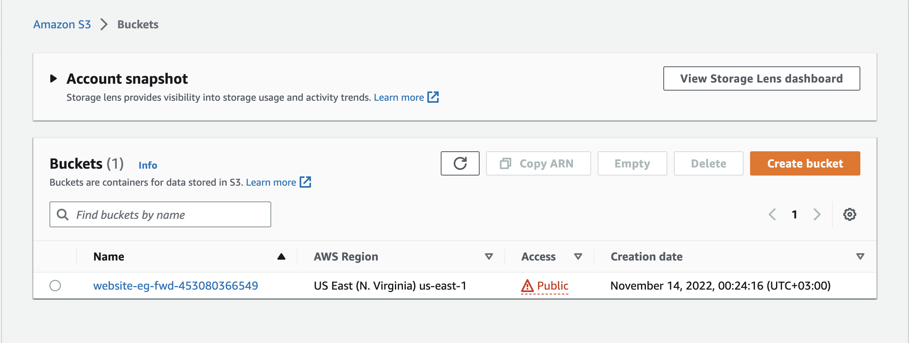
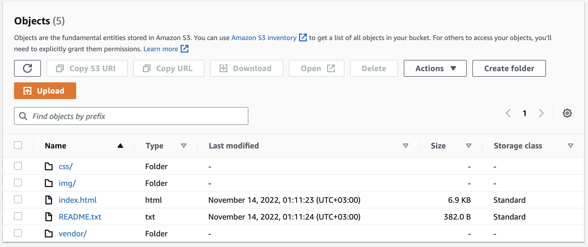
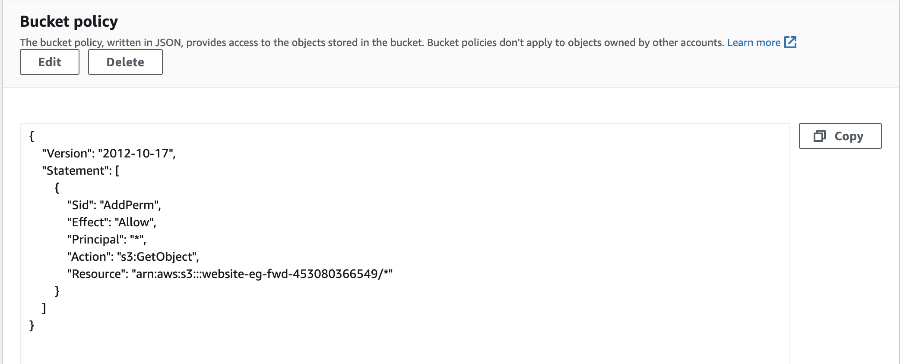
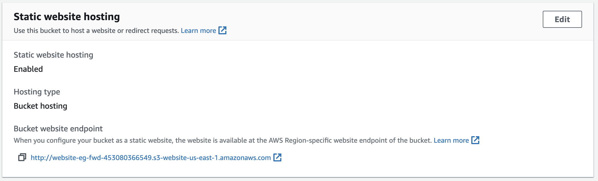
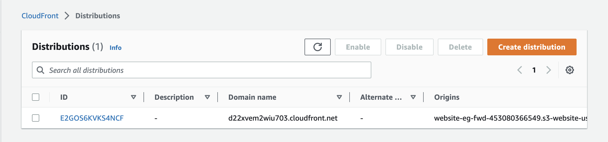

## [ Project Submission ]

## Screenshots

- The S3 bucket is visible in the AWS Management console

  

- All the website files uploaded to the newly created S3 bucket

  

- The bucket should allow public access. The S3 bucket has an IAM bucket policy that makes the bucket contents publicly accessible

  

- The S3 bucket is configured to support static website hosting

  

- CloudFront has been configured to retrieve and distribute website files

  

## URLs

| Source                  | Link                                                                  |
| ----------------------- | --------------------------------------------------------------------- |
| CloudFront Distribution | https://d22xvem2wiu703.cloudfront.net                                 |
| S3 Website Endpoint     | http://website-eg-fwd-453080366549.s3-website-us-east-1.amazonaws.com |
