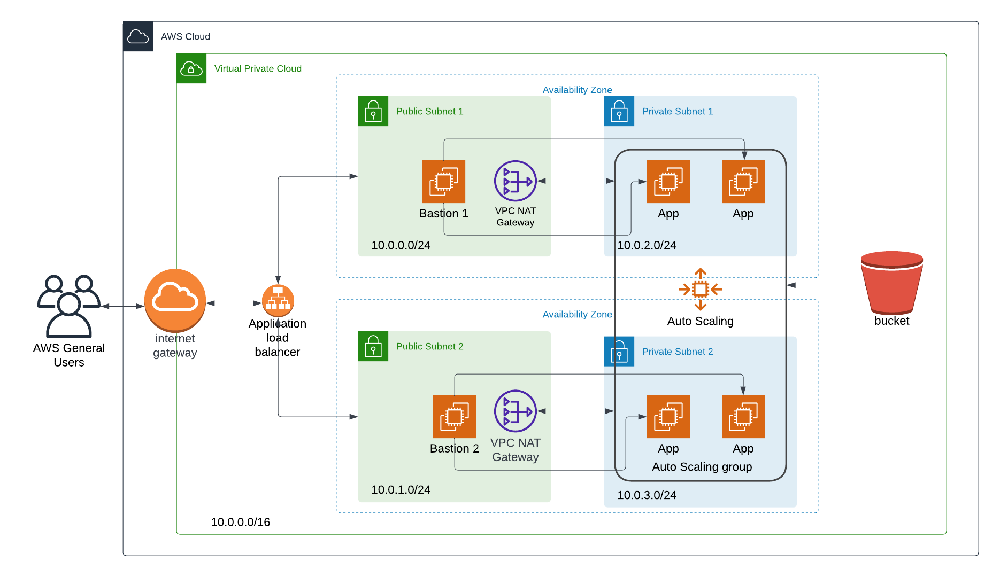

## [Project 2]

## Deploy a High-Availability Web App using CloudFormation

In this project, you’ll deploy web servers for a highly available web app using CloudFormation. You will write the code that creates and deploys the infrastructure and application for an Instagram-like app from the ground up. You will begin with deploying the networking components, followed by servers, security roles and software.

### Architecture Diagram



> Install [AWS CLI](https://aws.amazon.com/cli/).

```
aws --version
```

> Run this command to create Network:

```
./create.sh network network.yaml parameters/network.json
```

> Run this command to create S3 Role to access App Bucket:

```
./create.sh iam iam.yaml parameters/iam.json
```

> Run this command to create Bastion Host (JumpBox):

```
./create.sh iam bastion.yaml parameters/bastion.json
```

> Run this command to create Servers:

```
./create.sh iam servers.yaml parameters/servers.json
```

| Source                | Link                                                   |
| --------------------- | ------------------------------------------------------ |
| Load Balancer DNS URL | http://udagram-2027594861.us-east-1.elb.amazonaws.com/ |
